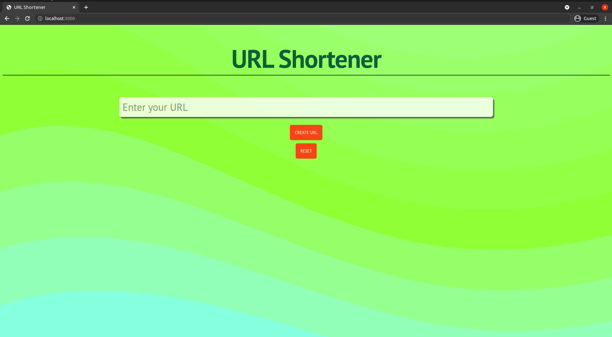
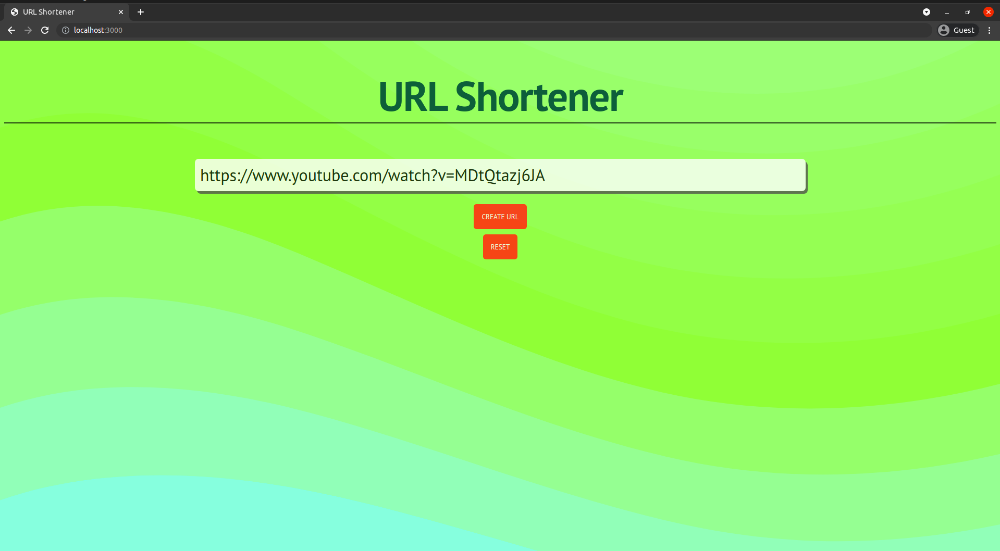
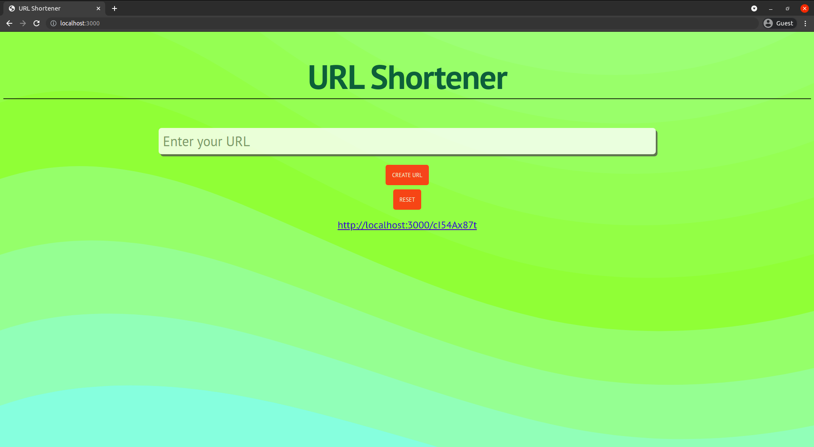

# URL shortner application using NodeJs & MongoDB

Application which shortens the url entered by the client
  
## Deployment

To deploy this project run

1. Clone the repo
```bash
git clone https://github.com/arinjaysaraf/url-shortener
```
2. Initiate npm in cloned repo folder 
  ```bash
npm init
```
3. Install & Run MongoDB

4. Run at localhost
```bash
node app.js
```
## Author

- [Arinjay Saraf](https://github.com/arinjaysaraf)
## Demo





